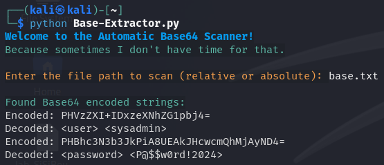

## Step 1: 
Grab a chonky file full of data.

## Step 2:
Execute the following.

```
python Base-Extractor.py
```
## Enter the Filename
You'll be prompted to enter the name of the hefty data file. Do it.

